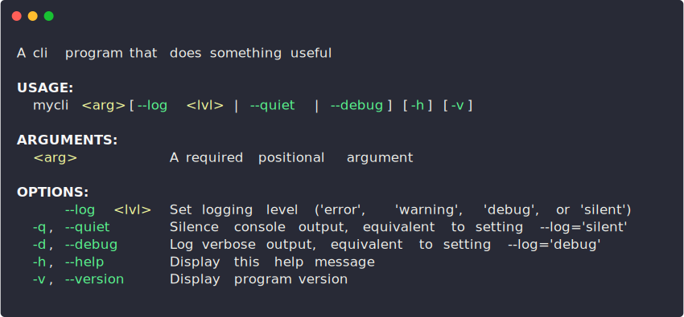

# help-output

[](https://travis-ci.com/luciancooper/help-output)
[](https://codecov.io/gh/luciancooper/help-output)


Create beautifully formatted help messages for your command line programs.

Pairs nicely with libraries like `minimist` and `yargs-parser` that are great for parsing command line arguments but don't have a help message generator built in.

## Installation

Install with `npm`:

```bash
npm install help-output
```

Or with `yarn`:

```bash
yarn add help-output
```

## Usage

Import the `helpOutput` function and pass it a configuration object with the name of your program, positional arguments, and options:

```js
const helpOutput = require('help-output')

const message = helpOutput({
    name: 'mycli',
    description: 'A cli program that does something useful',
    positional: [{
        name: 'arg',
        description: 'A required positional argument',
    }],
    options: [{
        name: 'log',
        arg: 'lvl',
        conflicts: ['q', 'd'],
        description: "Set logging level ('error', 'warning', 'debug', or 'silent')",
    }, {
        name: 'quiet',
        alias: 'q',
        description: "Silence console output, equivalent to setting --log='silent'",
    }, {
        name: 'debug',
        alias: 'd',
        conflicts: 'quiet',
        description: "Log verbose output, equivalent to setting --log='debug'",
    }, {
        name: 'help',
        alias: 'h',
        preferAlias: true,
        description: 'Display this help message',
    }, {
        name: 'version',
        alias: 'v',
        preferAlias: true,
        description: 'Display program version',
    }],
}, { width: 80 });

console.log(message);
```

Positional arguments and option flags are formatted into columns, and a git style usage section is automatically generated based on the information provided about them:

<p align="center">
    
</p>

## API

### `helpOutput(config, [options])`

A function that takes a `config` object and `options` object as arguments, and returns a help output message `string`. The `config` object is where you specify the arguments and options that will be displayed in the help output message, while the optional `options` object gives you some control over how the message will be formatted. 

#### Configuration

##### `config.name`

Type: `string`

The name of your cli program. If left unspecified, a name will be inferred from `process.argv`.

##### `config.title`

Type: `string`

An optional title to display at the top of the outputted help message. It can it can include two placeholder strings, `%name` and `%version`, which will be replaced by the values of `config.name` and `config.version`, respectively.

##### `config.version`

Type: `string`

The programs current version. This field only necessary if `config.title` is set and includes the `%version` placeholder string.

##### `config.description`

Type: `string`

An optional description of what the program does. If specified, it will be displayed at the top of the outputted help message, just below `config.title`.

##### `config.positional`

Type: `Object[]`

An array of objects specifying your programs positional arguments. They will be displayed in the order they are specified. Each argument spec object can contain the following properties:

   * `name` - The name of the positional argument (**required**).
   * `description` - A description of the argument. This property is not strictly required, but is strongly encouraged.
   * `optional` - A boolean (defaults to `false`) indicating whether the argument is optional.
   * `repeat` - A boolean (defaults to `false`) indicating whether the argument can be repeated.

##### `config.options`

Type: `Object[]`

An array of objects specifying your programs option flags. They will be displayed in the order they are specified. Each option spec object can contain the following properties:

   * `name` - The name of the option (**required**).
   * `description` - A description of the option. This property is not strictly required, but is strongly encouraged.
   * `arg` - A string, object, or array of either specifying one or more positional arguments the option takes. Object specs use the same structure as those specified in `config.positional` (minus the `description` field). String specs are equivalent to specifiying an object containing only a `name` property.
   * `alias` - A string or array of strings specifying any aliases for the option.
   * `preferAlias` - A boolean or string indicating that the options alias name should be used in the program usage section that gets generated. If value is a string, it must be one of the alias names specified for the option. Defaults to `false`.
   * `requires` - The name of another option that this option requires. Make sure that the option referenced here has been configured, otherwise an error will be thrown. References to alias names are allowed.
   * `conflicts` - Another option name or array of names that this option conflicts with. Make sure that these option names specified here reference other options that have been configured, otherwise an error will be thrown. References to alias names are allowed.

**Note:** relationships specified by the `requires` and `conflicts` fields are reflected in the program usage section that is automatically generated.

#### Options

##### `options.width`

Type: `number`

Character width to wrap the help output message to, defaults to the width of `process.stdout`.

##### `options.spacing`

Type: `number`

Size of the gap between table columns, default is `2`.

##### `options.indent`

Type: `number`

How much to indent the content of each section on the left side, defaults to the value of `options.spacing`.

##### `options.color`

Type: `boolean`

Whether the returned help message string should be colorized, default is `true`.

##### `options.styles`

Type: `Object`

Ansi colorization customizations This option is only relevant if `options.color` is `true`. Must be an object that maps *style selector ids* to *ansi style values*. The following are valid style selector ids that target different components of the help output string:

 * `'positional'` - selector id for positional arguments (default style is `'yellow'`).
 * `'option'` - selector id for option names (default style is `'green'`).
 * `'title'` - selector id for section titles (default style is `'bold.underline'`).

Specifying `null` or `''` for a selector id will result in no style being applied. Check out [`ansi-styles`](https://github.com/chalk/ansi-styles) for a list of valid style values, (multiple values must be separated by a `'.'`, or supplied as an array).
